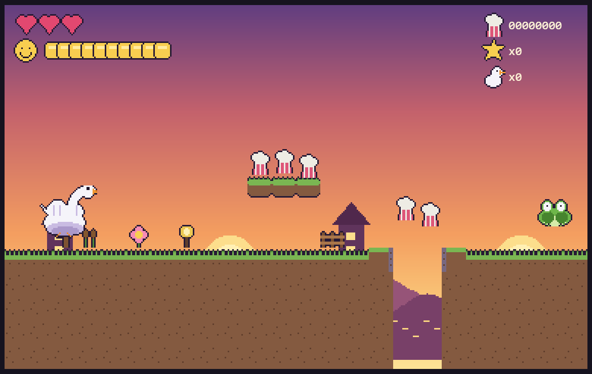
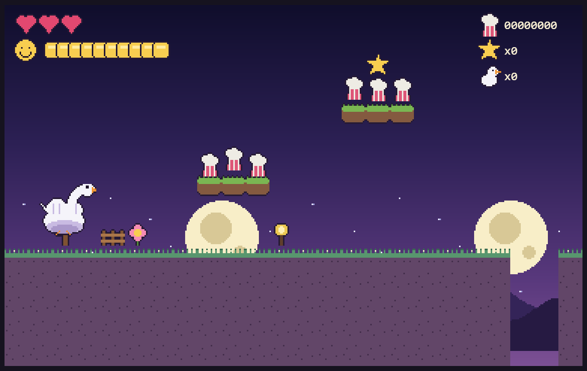
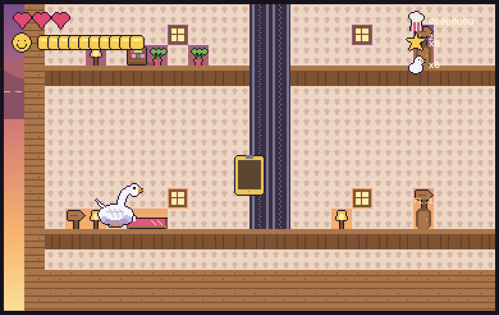
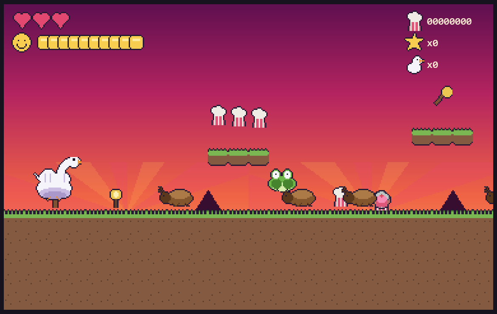
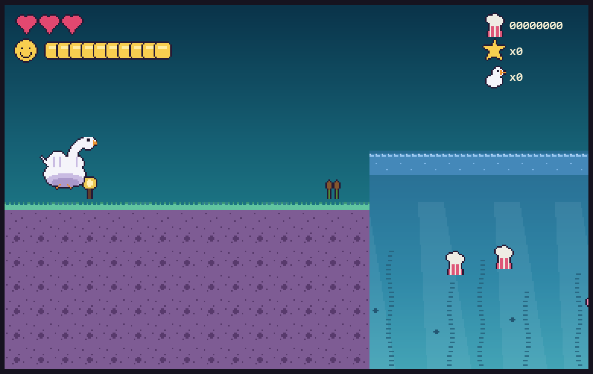
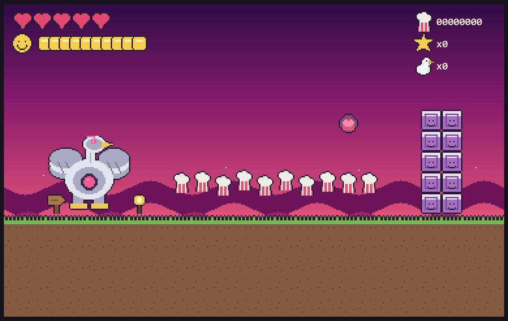

# MoonFlexForceAbilities

*A 2D 16-bit dream-platformer designed by Josie, age 4. Built like she's
Shigeru Miyamoto's 4-year-old.*

Every morning the family wakes in their impossibly tall house. Press the
invisible phone's unvisible button, become a swan, and dive into the
dream-lake: **six worlds**, the whole Grumpis Scrumption family, a cat face
that is ACTUALLY an alligator, moonlight T-Rex transformations, a happiness
meter that never stops draining, the Big Hog Dog who steals the babies, and a
finale where you are a **GIANT MECHA SWAN** and he is very, very sorry.

Buildless: vanilla JS + canvas, no bundler, no frameworks, no external
anything. All pixels are generated by the project's own art forge; all music
and sound is synthesized chiptune (intentionally a little bad, per the
designer's spec).

| | |
|---|---|
|  |  |
|  |  |
|  |  |

## Run it

```sh
python -m http.server 8000      # from the repo root
```

Open **http://localhost:8000**. Press `M` if the little bad music gets too
little bad. Dev shortcut: `http://localhost:8000/?level=3` drops you straight
into any world (1-6 or `hub`).

## Controls

| Action | P1 | P2 (Charmgirl, joins with Right-Shift) |
|---|---|---|
| Move | WASD / arrows (solo) | arrows |
| Jump / swim stroke / mid-air flap (×2) | `Space` / `W` / `↑` | `R-Shift` / `↑` |
| Action (laser, fire, spoon, nuts, pink) | `X` / `F` | `R-Ctrl` |
| The invisible phone (hold to see it; transform in water) | `Shift` / `E` | `/` |
| Ground pound (with Giant Goose Feet) | `↓` in mid-air | same |
| Drop through platforms / enter doors / root (Tree power) | `↓` (+jump on platforms) | same |
| Elevator | by the shaft: `X` to call/ride up, `↓` down (it can't strand you) | same |
| Pause | `Esc` | — |

## The dream, floor by floor

1. **The Dream Lake** — the slice level: lilypad hops, the first Grumpis.
2. **Moonlight Lake** — night. Giant Goose Feet, moons (MoonFlex! / T-Rex!),
   the burning tree rescue (stomp the flames, save the baby swan), and the
   Grumpis Twins, who enrage when you scrumption one of them.
3. **The Deep** — fully underwater. Mermaid country. Friendly cat faces that
   are not cat faces. Sunken treasure chests. Papa Grumpis surfaces between
   the lilypads and his armpits are exactly as advertised.
4. **Candy Clouds** — springs, cloud hops, a mush-block vault with a baby
   inside, and the whole Grumpis family at once.
5. **The Fever Swarm** — the Vampire-Survivors floor. Everything everywhere.
   The Giant Spoon (deflects mushrooms back at the sender). Beat the Big Hog
   Dog and he *takes the babies and runs*.
6. **MoonFlex Finale** — you are the Giant Mecha Swan. Fly. Default laser
   eyes. Ten million points. Mardi Gras beads. Then: sea turtles, calm water,
   credits.

The **tall house** is the hub: ride the elevator, each floor is a world,
every room is always neat. Happiness doesn't drain at home.

## Systems

- **Costume stack** (GDD §5.2): goose feet / laser eyes / kirby cap / spoon
  stack as worn layers. `C` hops you out of the top one and drops it as a
  regrabbable pickup. Taking a hit sheds a layer instead of a heart.
- **Treasure boxes**: 3 stars open a chest → choose Fire / Pink / Tree /
  Kirby. The right power trivializes the right boss. That's the point.
- **Happiness**: drains faster on deeper floors; treats refill; at zero you
  panic (half speed, enemies 1.5×). Mushrooms and armpit stink drain it too.
- **Moons**: Charmgirl goes full T-Rex (smash, stun, immune to little ones).
  A solo swan gets **MOONFLEX** — untouchable and fast while it lasts.
- **The name store** after every level: letters cost points (a million each
  at the finale), what you don't spend is your recorded score, run out and
  your name truncates forever.
- **Co-op**: Right-Shift drops Charmgirl in at any time; the camera frames
  both; a fallen player respawns beside their buddy.
- Progress (unlocked floors, rescued babies, hall of dreamers) persists in
  localStorage.

## The pipeline

```
tools/forge.py    original 8 sheets (slice roster)
tools/forge2.py   expansion: 22 more sheets + skies + parallax -> manifest.json
tools/levelgen.py all 7 maps -> levels/*.json
tools/headless/   node run.js          70-scenario full-game suite
                  node run.js bots.js  walks/swims/flies every level for real
js/               tuning · audio · core · physics · player · enemies ·
                  bosses · world · ui · main   (plain script tags, no build)
```

Every sprite, tile, sky gradient and parallax strip is forged by code into
real PNGs — zero art is drawn at runtime (the only non-sprite pixels are UI
text, the water tint, and bar fills). Music is a 3-channel WebAudio tracker
(pulse/pulse/triangle + noise drums) with a theme per world; the fever theme
is detuned on purpose.

**TUNING**: every feel number lives in `js/tuning.js`, grouped and commented.
The slice's movement block is preserved bit-for-bit and regression-tested
(jump heights, coyote, buffering — including buffering's priority over the
new mid-air flaps near the ground).

## Out of scope still (honest TODOs)

Carry/toss between co-op players; the Kirby copy-ability beyond the extra
flap; New Game+ remixes. Hooks are marked in code.

---

*Designed by Josie. Structured by Dad. Pixels, code, and little bad songs by
Claude. No babies were stolen permanently.*
